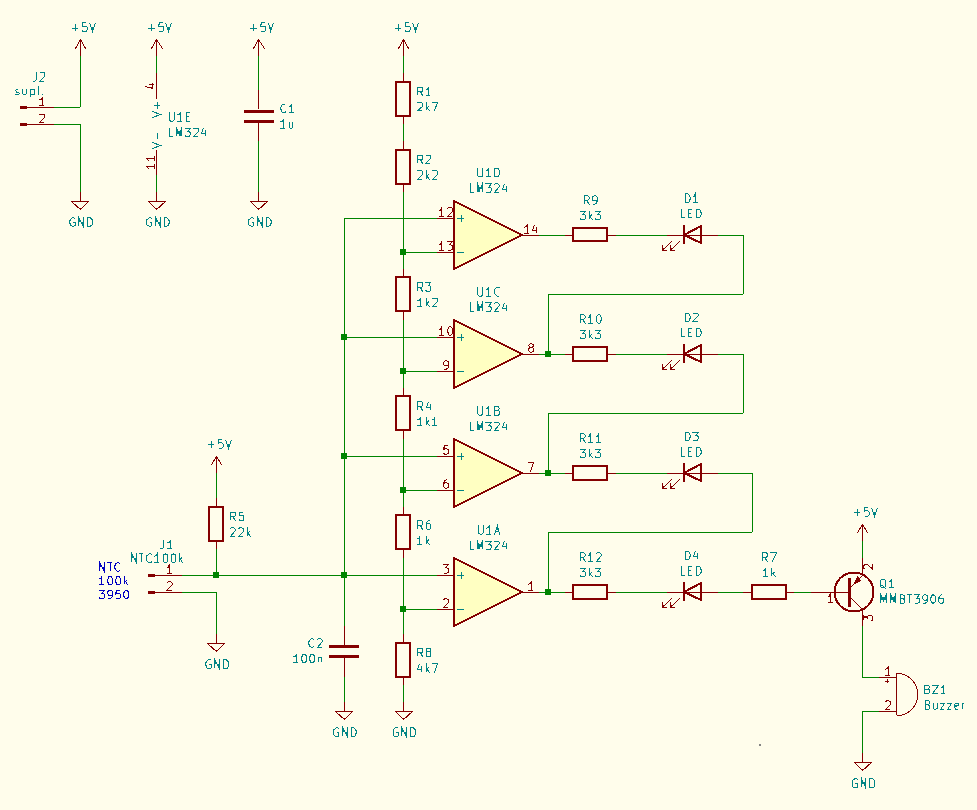
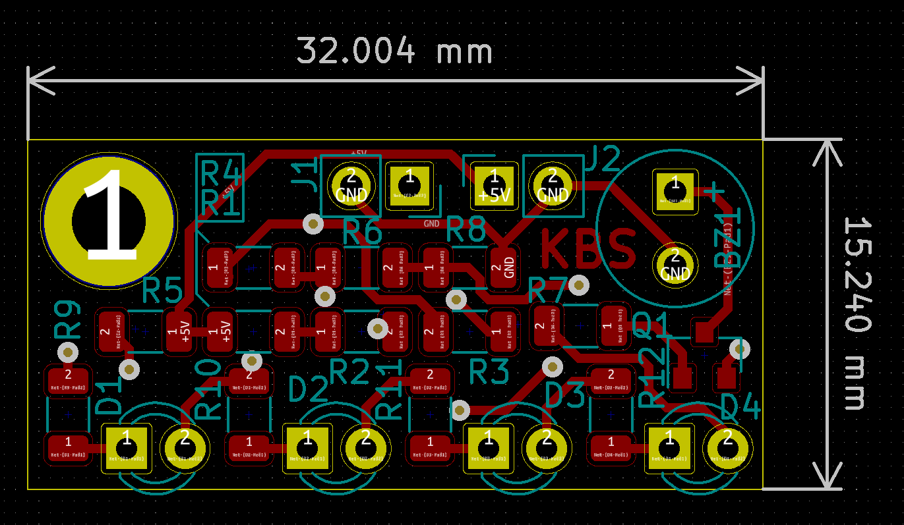
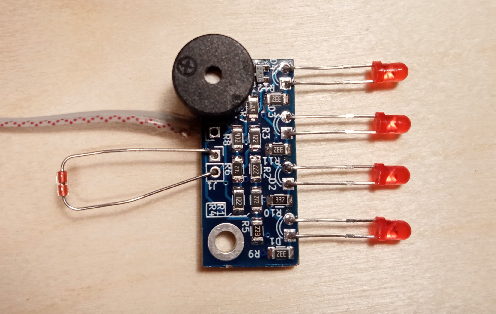

# LM324_Thermometer

Small four LEDs NTC thermometer. Only one LED is turned on at a time.

LED1=>50°C, LED2=>60°C, LED3=>70°C, LED4=>80°C, 
Or you can calculate your own values with an included spreadsheet.

https://www.youtube.com/watch?v=8DjqupTEYBM

